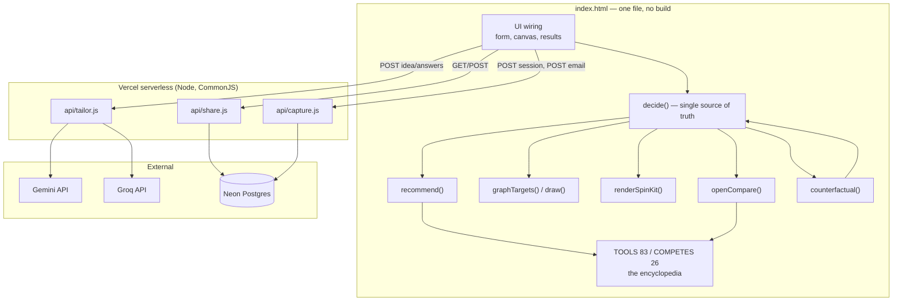

# ARCHITECTURE.md — how Groundwork fits together

Indexed 2026-09-04 against `index.html` @ 2024 lines, md5 `33c3da718f58b159565e3e9478f9b9f3`
(commit `3a1f721`). Backend files unchanged since the first index.

See [../CLAUDE.md](../CLAUDE.md) for the working agreement, [MODULE_MAP.md](MODULE_MAP.md)
for the dependency graph, [DATA_FLOW.md](DATA_FLOW.md) for traced flows.

## System overview

Four layers, and only the first is required for the product to work:

| Layer | Lives in | Responsibility | Degrades to |
|---|---|---|---|
| **Deterministic advisor** | `index.html` (JS 356–1503) | Profile the answers, decide 24 stages, generate reasoning, render the canvas | — (always works, offline, no keys) |
| **Presentation / UI** | `index.html` (CSS 13–274, HTML 276–353, wiring 1506–1720) | Questionnaire, canvas animation, result rendering, share, modals | — |
| **AI tailoring** | `api/tailor.js` | Follow-up questions, idea-specific insights, build brief | 501 → button hides, `AI_ON=false` |
| **Persistence** | `api/share.js`, `api/capture.js`, Neon | Short links, anonymous session capture, opt-in email | 501 → long `?p=` link; capture silently no-ops |

**The load-bearing rule:** the browser never touches the database. Only `/api/*` does, using
the DB owner role, which is why there is no RLS in `db/schema.sql`.

## The two registries, and why they differ

This is the single most confusing thing about the codebase, so it is stated up front:

| Registry | Size | Drives |
|---|---|---|
| `STAGES` `index.html:362` | **16** stages, 42 option nodes | The **canvas only** — the tentacles and nodes in the tangle |
| `COMPETES` `index.html:779` | **26** stages | The full decision set: cards, compare tables, "options it beat" |
| `decide()` `index.html:453` | **24** `set()` calls | Every stage that gets a pick |
| `LAYER_OF` / `ROLE2STAGE` | 26 each | Every stage → its layer, and every card role → its stage |

The 10 stages in `COMPETES` but not `STAGES` are `site`, `platform`, `cms`, `glue`,
`support`, `marketing`, `forms`, `legal`, `uptime`, `backup`. They are **cards only, by
design**: the canvas labels only *chosen* nodes, so extra tentacles crowd the tangle without
adding feeling. `site` and `platform` are the two that `decide()` also skips — they are
verdict-level alternatives reached through `ROLE2STAGE`, not picks.

Consequence: `clarity` in `applyTargets` `index.html:1399` is `decided / STAGES.length` —
progress is measured over the 16 canvas stages, not all 24 decided ones.

## Component dependency diagram

`counterfactual()` calling back into `decide()` is the one deliberate cycle: it flips every
answer through its other values and re-runs the engine, so the "had you said X" line **is**
the rules asked backwards and cannot drift from them.

## External dependencies and integrations

| Integration | Configured by | Where read | Absent behaviour |
|---|---|---|---|
| Google Gemini | `GEMINI_API_KEY` (or `GOOGLE_API_KEY`) | `api/tailor.js:14`, `:137` | falls through to Groq |
| Groq | `GROQ_API_KEY` | `api/tailor.js:15`, `:116` | 501 `not_configured` |
| Provider choice | `AI_PROVIDER`, `TAILOR_MODEL` | `api/tailor.js:17-26`, `:117`, `:138` | Gemini preferred; default models |
| Neon Postgres | `DATABASE_URL` (auto-set by the Vercel↔Neon integration; also accepts `POSTGRES_URL`, `DATABASE_URL_UNPOOLED`, `POSTGRES_URL_NON_POOLING`) | `api/share.js:14-17`, `api/capture.js:24-27` | 501; frontend falls back |
| Google Fonts | `<link>` in the `index.html` head | — | system font stacks are declared as fallbacks |

Only runtime npm dependency: `@neondatabase/serverless` ^0.10.4. The frontend has **none**.

## Build and deploy

There is no build. The runnable artifact *is* the repo.

1. Push to `main` on GitHub.
2. Vercel auto-deploys. Framework preset **Other**; zero-config routing serves `index.html`
   at `/` and runs every file in `api/` as a Node serverless function at `/api/<name>`.
3. `vercel.json` adds `cleanUrls`, `trailingSlash:false`, and two security headers
   (`X-Content-Type-Options: nosniff`, `Referrer-Policy: strict-origin-when-cross-origin`).
4. Public access requires Vercel Authentication **off** under Settings → Deployment Protection.

The database is **not** deployed from the repo. `db/schema.sql` is already applied to the
live Neon project and is kept as the source of truth for re-creating it elsewhere. There is
no migration tooling; both tables use `create table if not exists`.

## Cross-cutting concerns

| Concern | Owner | Pattern |
|---|---|---|
| Config | Environment variables only; documented in `.env.example` | Read at **call time**, never at import, so tests can swap it per case |
| Auth | None. No users, no sessions, no cookies | Session ids are client-generated UUIDs, anonymous |
| Error handling (server) | Each handler's own `try/catch` | Always returns JSON `{error, detail}` with a truncated detail; never throws to Vercel |
| Error handling (client) | `api()` at `index.html:1741` | 404/501 → `Error` with `code:"off"` → the feature flags itself off |
| Feature degradation | `AI_ON` `index.html:1722`, `CAPTURE_ON` `:1723` | Every enhancement is wrapped so a missing function is invisible |
| Logging | None. No logger, no analytics on Groundwork itself | Deliberate |
| Validation | `VALID` in `api/share.js:19` and `api/capture.js:29` | Whitelist the 8 answers; reject the whole payload on any bad value |
| Privacy | `api/capture.js` header comment + `db/insights.sql` header | Anonymous rows; `email` only on explicit consent, in its own column, never in the aggregate |
| Escaping | `esc()` `index.html:1615`, `escHtml()` `:1738`, `escAttr()` `:1739` | All result HTML is string-built; anything from a user or a model goes through one of these |
| Complexity budget | `carryBand()` `index.html:819`, `heavyPicks()` `:829` | Every tool has a `weight`; picks above the founder's band are **named**, not swapped |
| Sequencing | `coherence.now` / `.later` `index.html:1338–1341` | 18 cards is a wall; the now/later split turns the list into an order |
| Theming | CSS custom properties on `:root` `index.html:14`, plus `@media (prefers-color-scheme:dark)` and `:root[data-theme="dark"]` | The canvas reads the same tokens at draw time via `css()`/`hex()` `:1424`, `:1445` |
| Motion | `reduce` `index.html:357` (`prefers-reduced-motion`) | Animation collapses to a single settled frame |
